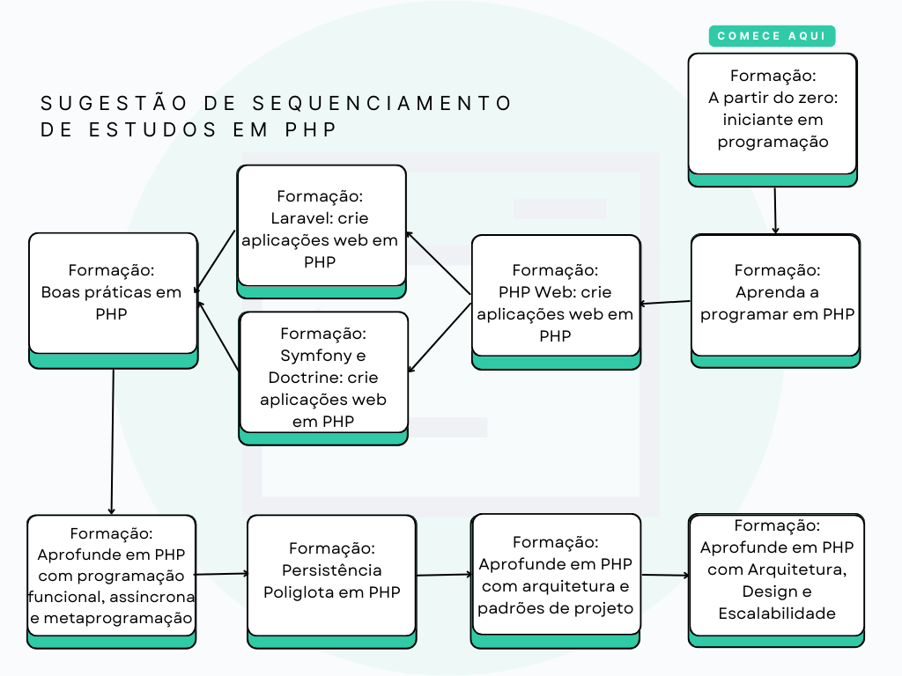

# ? Jornada de Estudos - Formação PHP Alura

Este repositório é o registro e o acompanhamento da minha jornada de aprendizado na Formação PHP da Alura. O objetivo é documentar o progresso, armazenar os projetos, exercícios e anotações de cada curso, seguindo o roadmap sugerido pela plataforma.

## ?? Roadmap de Estudos

A jornada segue o sequenciamento de cursos e formações conforme o diagrama abaixo, que guia o caminho do iniciante até tópicos avançados em PHP.

## ? Organização do Repositório

A estrutura foi planejada para refletir a organização da Alura. Cada **Formação** no roadmap possui seu próprio diretório principal, e dentro dele, há arquivos `README.md` individuais para cada **curso**, detalhando o conteúdo aprendido.

- **`Formação - Aprenda a programar em PHP com orientação a Objetos/`**:
    - Este diretório contém os arquivos de código e a documentação dos primeiros cursos da formação.
    - **`README-Curso-1- Criando-sua-Aplicacao.md`**: Detalhes do primeiro curso.
    - **`README-Curso-2- Evolua-seu-conhecimento-organize-seu-código.md`**: Detalhes do segundo curso.
    - **`README-Curso-3- Conheça-a-programação-orientada-a-objetos.md`**: Detalhes do curso sobre POO.
    - **`README-Curso-4- Use-interfaces-Namespaces-traits-e-Exceções.md`**: Detalhes do curso sobre POO.

## ? Status Atual

Atualmente, estou na **Formação: Aprenda a programar em PHP com orientação a Objetos**, tendo concluído os três primeiros cursos e construído os fundamentos da linguagem, além de uma base sólida em Programação Orientada a Objetos.

---

*Última atualização: 31 de Julho de 2025*